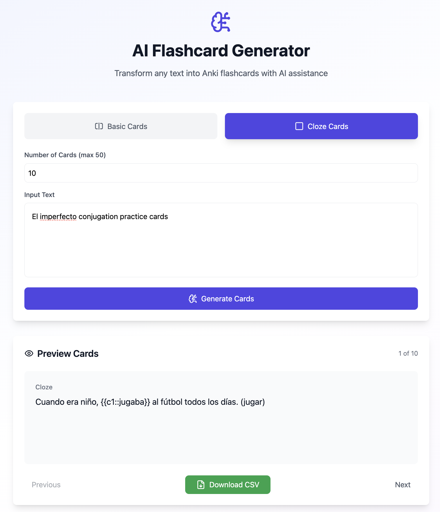

# AI Flashcard Generator

[](https://app.netlify.com/sites/anki-generator/deploys)

> 🚀 **[Try it live: anki-generator.netlify.app](https://anki-generator.netlify.app/)**

Transform any text into Anki-compatible flashcards using AI. This tool leverages the Gemini AI model to automatically generate high-quality flashcards for effective learning. Perfect for language learning, exam preparation, and knowledge retention.



## Features

### 🎯 Two Card Types

- **Basic Cards**: Traditional question-answer format
- **Cloze Cards**: Fill-in-the-blank style with support for multiple deletions (c1, c2, etc.)

### 🤖 AI-Powered Generation

- Automatically creates up to 50 cards from any input text
- Maintains the input language (great for language learning!)
- Generates practical, context-rich examples
- For conjugation cards, includes infinitive forms

### 📤 Anki Integration

- Export cards directly to Anki-compatible CSV format
- Basic cards export with front/back fields
- Cloze cards export with proper Anki cloze syntax

## Quick Start

**🌐 Web Version**: Visit [anki-generator.netlify.app](https://anki-generator.netlify.app/) to use the tool directly in your browser.

**🔑 API Key**: Get your free Gemini API key from [Google AI Studio](https://aistudio.google.com/apikey)

## Local Development

1. **Setup**

   ```bash
   # Clone the repository
   git clone [repository-url]
   cd [repository-name]

   # Install dependencies
   npm install
   ```

2. **API Key**

   - Get your Gemini API key from [Google AI Studio](https://aistudio.google.com/apikey)
   - Enter it in the settings (gear icon)

3. **Run the Application**
   ```bash
   npm run dev
   ```

## Usage

1. Choose your card type (Basic or Cloze)
2. Set the number of cards you want (1-50)
3. Enter your text
4. Click "Generate Cards"
5. Preview the generated cards
6. Download as CSV for Anki import

## Technical Details

- Built with React + TypeScript
- Uses Tailwind CSS for styling
- Integrates with Google's Gemini AI API
- Supports markdown code block parsing
- Error handling for API and JSON responses
